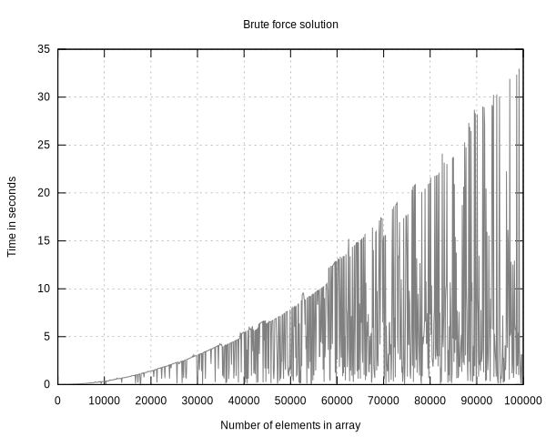

# Minimal Performance Check

**Goal:** measure time down to the millisecond for an executable giving it 
different parameters and use gnuplot to draw a time/parameter graph.

## Execution

### Prerequisites

In order to make it work, a few things are required:
- make (unless you want to compile by hand)
- gcc
- gnuplot (for outputing the graphs)

### Input and output

The program requires a file with data in `CVS format` to be passed as an argument
in order to work. Also note that the data **must be sorted** by the chosen x axis 
(see option --x-axis-column) in order to be correctly generated by `gnuplot`.  

As for the output, for now a file name **graph.svg** is outputed and the type/name 
cannot be changed via arguments. However, two other files are also generated: **data.dat** 
and **gnuplot\_cmd**. These contain, respectively, the data used by gnuplot in order 
to generate the graph and the commands passed to gnuplot to generate the graph. 
These files have been kept in case the user wants to replot the data differently.
However, do note that they will be **deleted** by the next execution unless moved.

## Make commands

All these *make commands* are to be executed at the root of the project.

| Command           | Description                                                                       |
|---                |---                                                                                |
| make              |Compiles the project and moves the executable in the output folder.                |
| make clean        |Cleans the whole project (including the test folder).                              |
| make test         |Compiles the project, the tests and executes the tests.                            |

## Options

|Long option        | Short option  | Description                                                           | Required  |
|---                | ---           | ---                                                                   | ---       |
|--help             | -h            | Prints help message and exits.                                        |           |
|--executable V     | -e V          | Path to executable for measuring its execution time.                  | Yes       |
|--entries V        | -v V          | Path to file containing the data to test (must be sorted by x axis).  | Yes       |
|--x-axis-column V  | -x V          | Specify column by which to create the x axis (count starts with 1).   | Yes       |
|--title V          | -t V          | Give a title to the outputed graph.                                   |           |
|--x-axis-name V    | -n V          | Add legend to the x axis.                                             |           |
|--parallel V       | -p V          | Use V threads (speedup process).                                      |           |

## Examples

Example of outputed graphs:

More examples can be found in the [two numbers test documentation](test/two_numbers_test/solutions/README.md) 
and the [threads test documentation](test/threads_test/README.md).

## Todo list

- [x] Understand why the slow solution performed better than the fast one (see examples).
- [ ] Add options for output format and file.
- [x] Multithreading and option for using more than one thread.
- [ ] Add a y axis.
