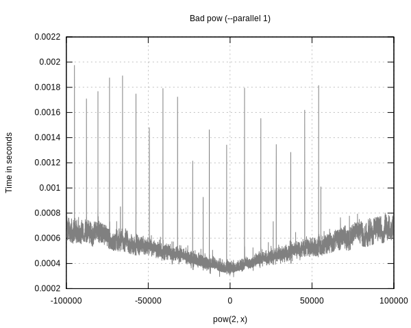
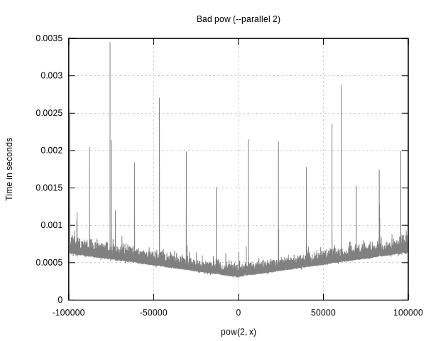
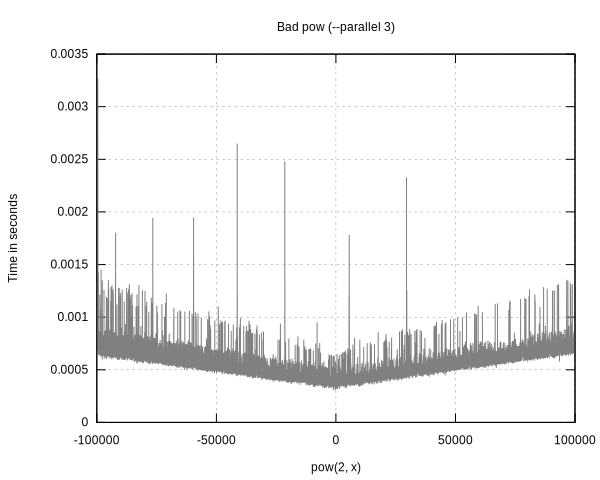
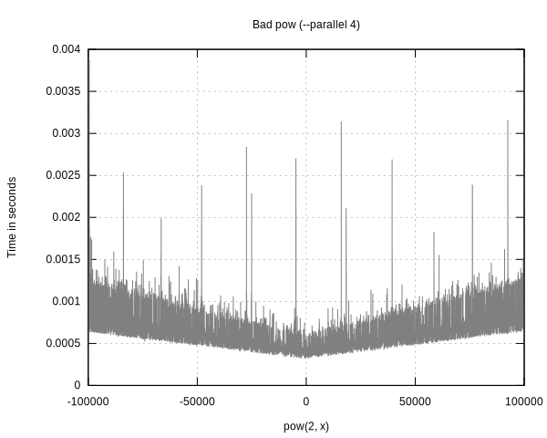

# Threads test

## Test principle

The goal of this test is to see the speedup depending on the number of specified 
threads with the option `--parallel`.

In order to measure it I have written a small program called `bad_pow` which 
ineffectively computes the power of 2 by an x varying from -100 000 to 100 000 
by steps of 10.
 
The test is run by the script `test.sh` which permits to measure the time taken 
by each execution using the command `time`. You can modify the range of threads 
for which you want to view a result by modifying the Makefile or running it
specifying the maximum as seen below.

## Test results

```
$ ./test.sh 4
Time taken for --parallel 1: 0m14.466s
Time taken for --parallel 2: 0m8.088s
Time taken for --parallel 3: 0m6.606s
Time taken for --parallel 4: 0m6.346s
```

Here are the obtained graphs for each:





