# Two numbers test

## Explaining the test

The test is originally a [leetcode problem](https://leetcode.com/problems/two-sum/).
To sum up, the goal is to find the index of two numbers in a given array of which the 
sum is equal to a target.

Example:
```
array=[4, 6, 8, 9] and target=10

result is [0, 1]
```
To test the execution time, we generate files with 200 to 100 000 random 
numbers ranging from -1000 to 1000 by step of 100. These files are then read 
by our test programs.

Three algorithms have therefore been implemented. However, we will only explain 
the _brute force solution_ and the _fast solution_.

### Brute force solution

For each number we go through every number n1 of the array trying to find a 
number n2 for which n1 + n2 = target.

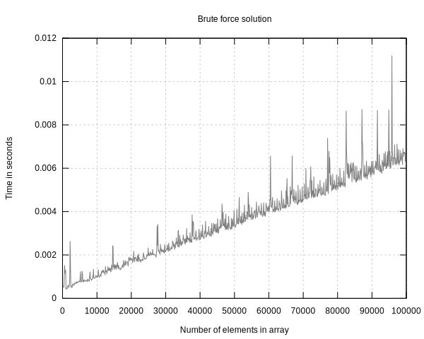

### Fast solution

We store every entry of the array into a hashmap with their value as the key and 
their index as the value. Then, for every key in the hashmap, we compute the
complement (= target - key) and search for the complement in the hashmap.

First version of the fast solution (explanation below).
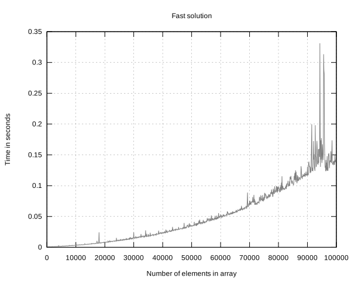

Second version of the fast solution.
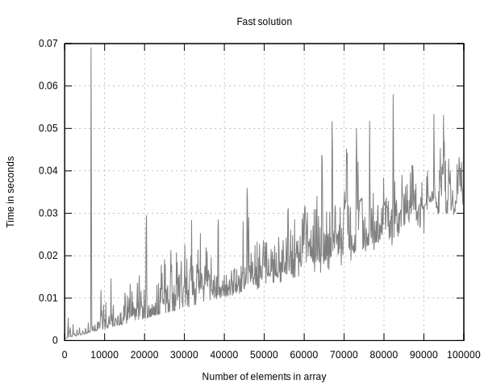


## Explaining the results

The supposedly fast solution turned out slow (O(n^2))
for values ranging from -1000 to 1000 whereas the slow solution 
(brute force algorithm) turned out pretty fast (O(n)).

The brute force algorithm turned out fast on this range of values because 
the probability of finding our target (9) in a range of -1000 to 1000 is high. 
It was most of the time finding it on the first iteration.

The fast solution algorithm's hashmap was faulty: the values were hashed considering 
the number of expected values (modulo size). Therefore, for values ranging from 
-1000 to 1000 only using a small percentage of the hashmap was being used. The values 
were added in the same arrays and therefore researching a value took an unbelievable 
amount of time.

Here are graphs illustrating this:

| Value range | Fast solution                           | Brute force solution                          |
|:---:        |:---:                                    |:---:                                          |
|[-10^3,10^3] |        |       |
|[-10^4,10^4] |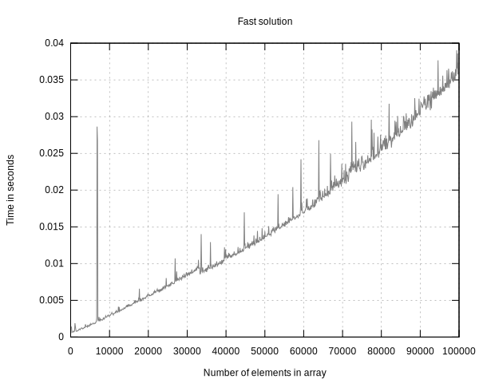       |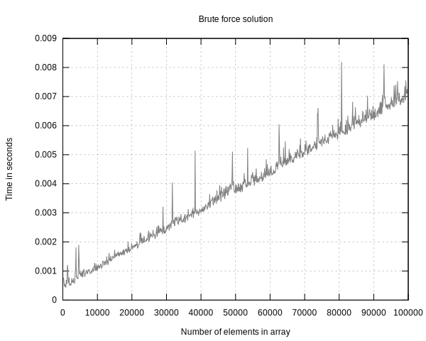      |
|[-10^5,10^5] |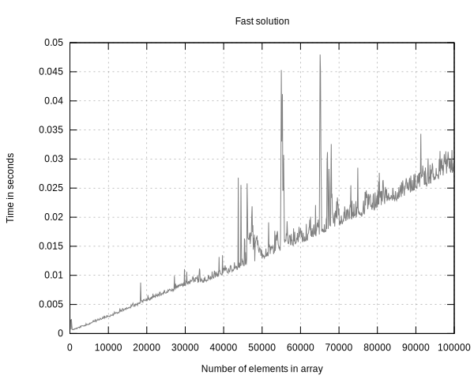      |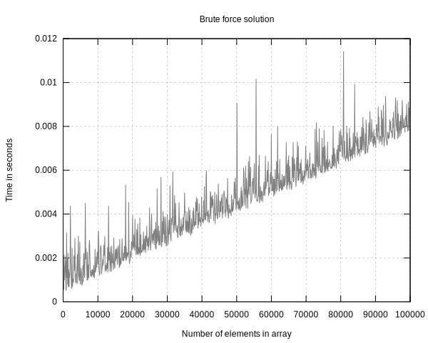     |
|[-10^6,10^6] |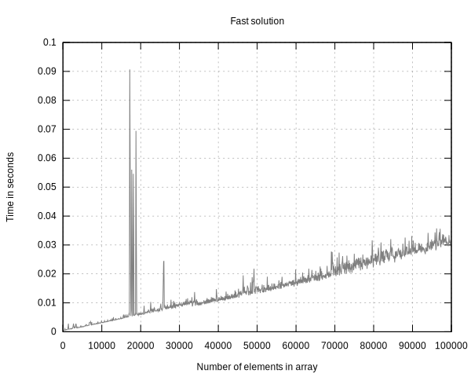     |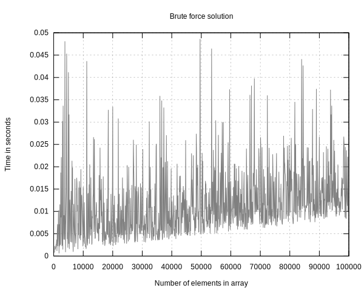    |
|[-10^7,10^7] |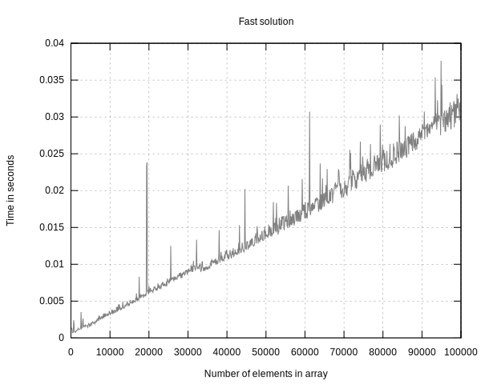    |   |
|[-10^8,10^8] |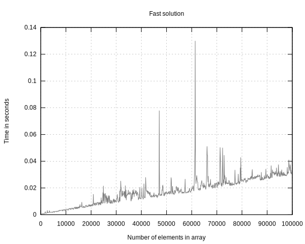   |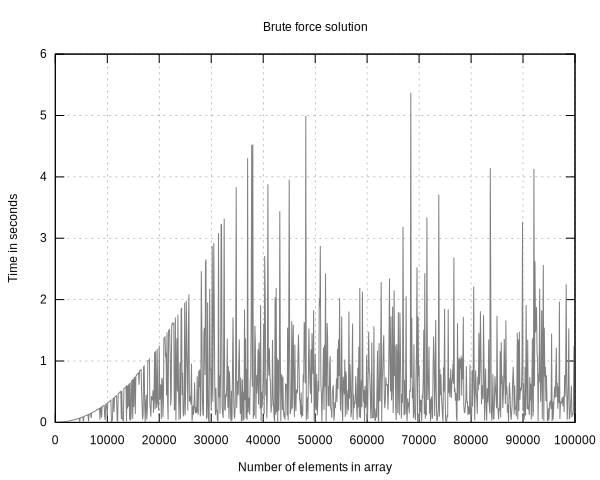  |
|[-10^9,10^9] |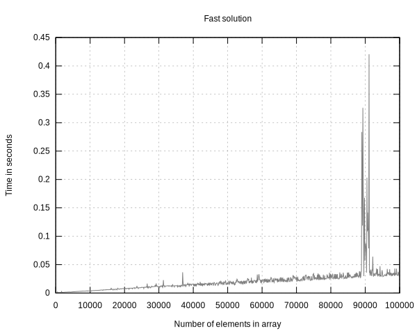  |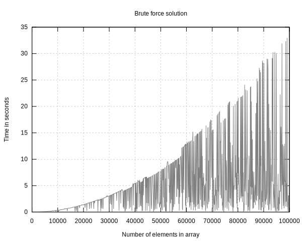 |

Here we compare the fast version to its revisited version. The the hashing 
algorithm has been modified (multiplying by Knuth's Constant), was therefore 
made an the improvement is visible on values ranging from -1000 to 1000.

| Value range | Fast solution                           | Fast solution revisited                       |
|:---:        |:---:                                    |:---:                                          |
|[-10^3,10^3] |        |    |
